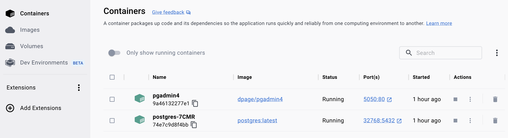

Admin dashboard
============================

Dashboard with admin login, admin panel

# dotnet CLI

## new webapp

make new folder named admin-dashboard

```
dotnet new webapp -lang "C#" -f "net6.0" --auth Individual --use-local-db --no-https --kestrelHttpPort 8086 --use-program-main
```

## change data provider

1. remove SqlServer

```
dotnet remove package Microsoft.EntityFrameworkCore.SqlServer
```

2. Install Prerequisites of PostgreSQL

```
dotnet add package Npgsql.EntityFrameworkCore.PostgreSQL
dotnet add package Microsoft.EntityFrameworkCore.Design
```

_Previously an Npgsql.EntityFrameworkCore.PostgreSQL.Design nuget package existed alongside the main package. Its contents have been merged into the main Npgsql.EntityFrameworkCore.PostgreSQL and no new version has been released._

3. modify appsettings.json

```json
  "ConnectionStrings": {
    "DefaultConnection": "Host=localhost;Port=32768;Database=kids_bookstore;Username=postgres;Password=postgrespw"
  },
```

4. modify Program.cs

```csharp
builder.Services.AddDbContext<ApplicationDbContext>(options => options.UseNpgsql(connectionString));
```

5. Run database Migration

delete Migrations folder under Data directory manully.

```
dotnet ef migrations add InitialCreate
```

after execute, result as below:

Build started...
Build succeeded.
Done. To undo this action, use 'ef migrations remove'

_The default value generation strategy has changed from the older SERIAL columns to the newer IDENTITY columns, introduced in PostgreSQL 10._

6. update database

```
dotnet ef database update
```

7. scaffold Razor pages for Model

install The aspnet-codegenerator scaffolding tool.

```
dotnet tool install --global dotnet-aspnet-codegenerator --version 6.0.11
dotnet add package Microsoft.VisualStudio.Web.CodeGeneration.Design --version 6.0.11
dotnet add package Microsoft.EntityFrameworkCore.SqlServer --version 6.0.13
```

8. Scaffold the CRUD pages of model

- Category

```
dotnet aspnet-codegenerator razorpage -m Category -dc ApplicationDbContext -udl -outDir Pages/Categories --referenceScriptLibraries
```

- Book

```
dotnet aspnet-codegenerator razorpage -m Book -dc ApplicationDbContext -udl -outDir Pages/Books --referenceScriptLibraries
```

# Install and Run PostgreSQL using Docker

I used Docker Desktop on Mac, and it is straightforward.



if you favor docker CLI, scaffolded commands as below:

## Install and Configure PSQL using Docker

```
docker-compose -f docker-compose.yml up -d
```

## Install PG-admin using Docker

```
docker run --rm -p 5050:80 dpage/pgadmin4 
```

# refs

- [How To Install and Run PostgreSQL using Docker ?](https://dev.to/shree_j/how-to-install-and-run-psql-using-docker-41j2)
- [How to run a PostgreSQL database using Docker Compose in just a few minutes?](https://blog.christian-schou.dk/run-postgresql-database-using-docker-compose/)
- [Postgres with Docker and Docker compose a step-by-step guide for beginners](https://geshan.com.np/blog/2021/12/docker-postgres/)
- [Compose file specification](https://docs.docker.com/compose/compose-file/)